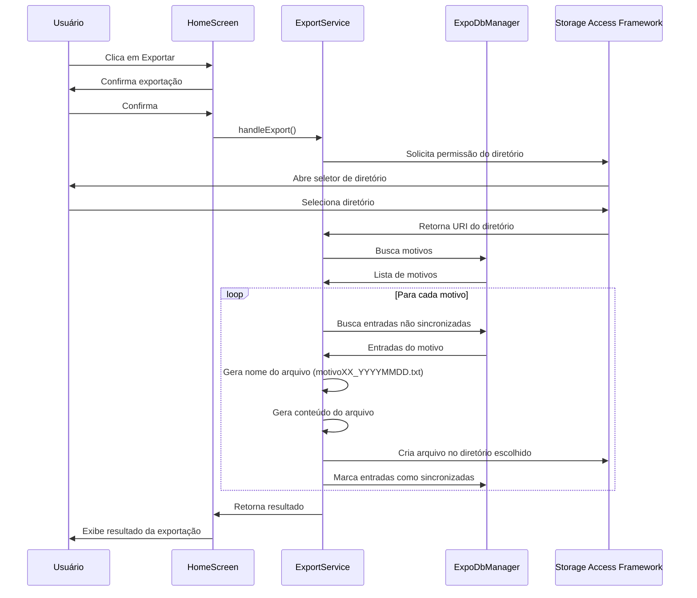

# Implementação do Storage Access Framework

## Visão Geral

Adaptação do sistema de exportação para usar o Storage Access Framework (SAF) do expo-file-system, permitindo que o usuário escolha o diretório de salvamento dos arquivos .txt.

## Fluxo de Exportação

## Mudanças Necessárias

### 1. ExportService.js

#### Métodos a Remover
- createBaseDirectories()
- createReasonDirectory()
- checkExistingStructure()
- listExportedFiles()

#### Métodos a Atualizar

**exportData()**
- Adicionar solicitação de permissão via SAF
- Tratar cancelamento/negação de permissão
- Usar URI retornado para salvar arquivos
- Remover criação de estrutura de diretórios

**showExportResults()**
- Incluir URI do diretório escolhido no log
- Atualizar mensagem para refletir novo local de salvamento

#### Métodos a Manter
- generateFileName()
- generateFileContent()

### 2. HomeScreen.js

#### Atualizar handleExport()
- Adicionar alerta inicial sobre seleção de diretório
- Tratar cancelamentos e erros de permissão
- Manter feedback existente para sucesso/erro

### 3. Componentes Mantidos Sem Alteração

- Funções do expoDbManager:
  * getReasons()
  * getUnsynchronizedEntriesByReason()
  * markEntriesAsSynchronized()
- Formato dos arquivos .txt
- Nomenclatura dos arquivos (motivoXX_YYYYMMDD.txt)
- Lógica de sincronização de dados

## Tratamento de Erros

1. Permissão negada pelo usuário
2. Cancelamento da seleção de diretório
3. Falha na criação de arquivos
4. Erros de acesso ao diretório selecionado

## Feedback ao Usuário

1. Alerta inicial para seleção de diretório
2. Mensagens claras para erros de permissão
3. Progresso da exportação
4. Resultado final com local dos arquivos (URI)

## Compatibilidade

- Android: Uso direto do SAF
- iOS: Fallback para document picker padrão