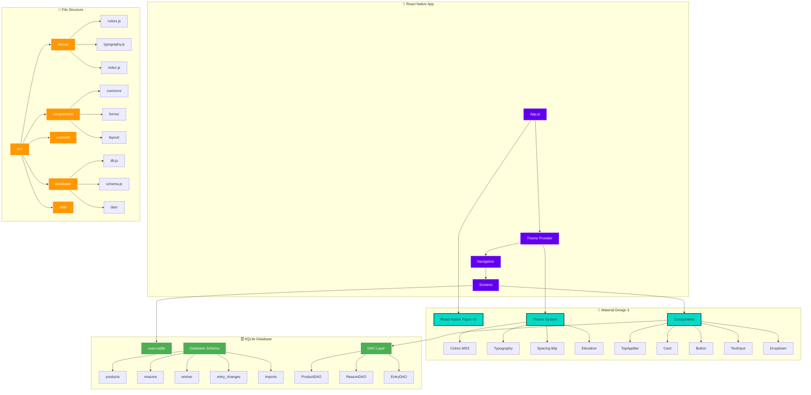
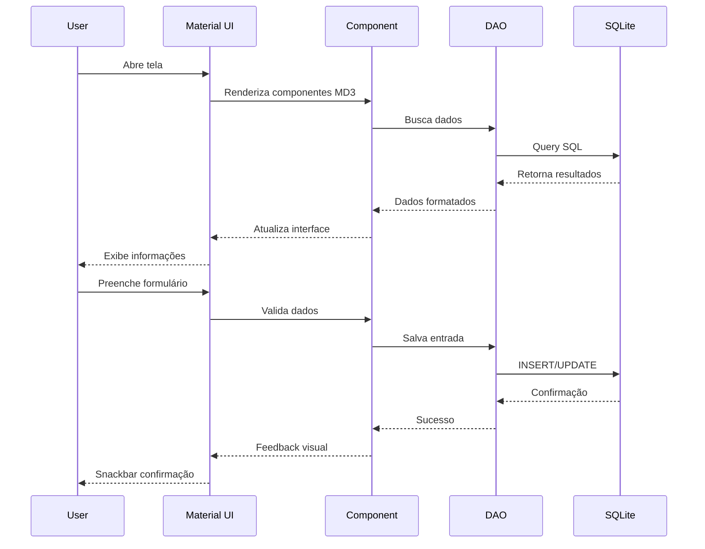
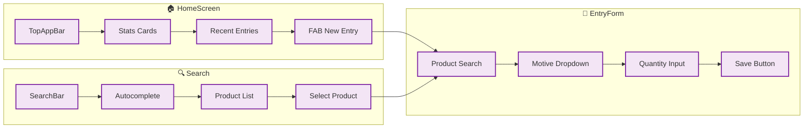

# Arquitetura do Projeto - Material Design 3 + SQLite

## 🏗️ Diagrama de Arquitetura



## 🔄 Fluxo de Dados



## 🎯 Componentes Principais



## 📊 Performance Targets

| Operação | Target | Método |
|----------|--------|--------|
| **Autocomplete** | <50ms | Índices + LIMIT |
| **Form Save** | <100ms | Transações |
| **Screen Load** | <200ms | Lazy loading |
| **Search** | <30ms | FTS + Cache |

## 🎨 Material Design 3 Implementation

```mermaid
graph TB
    subgraph "Theme System"
        T1[Material Theme] --> T2[Color Tokens]
        T1 --> T3[Typography Scale]
        T1 --> T4[Motion System]
        
        T2 --> T2A[Primary: #6200EE]
        T2 --> T2B[Secondary: #03DAC6]
        T2 --> T2C[Error: #BA1A1A]
        T2 --> T2D[Success: #4CAF50]
        
        T3 --> T3A[Roboto Font]
        T3 --> T3B[Scale: 12-32sp]
        
        T4 --> T4A[Duration: 200-300ms]
        T4 --> T4B[Easing: Standard]
    end
    
    classDef theme fill:#6200EE,stroke:#fff,stroke-width:2px,color:#fff
    classDef token fill:#03DAC6,stroke:#000,stroke-width:2px
    
    class T1 theme
    class T2A,T2B,T2C,T2D,T3A,T3B,T4A,T4B token