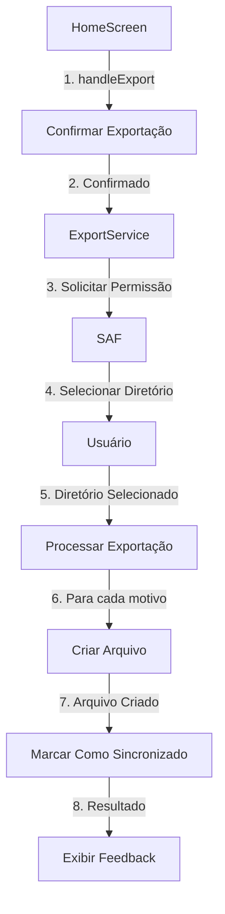

# Plano de Implementação da Exportação com SAF

## 1. Visão Geral das Mudanças



## 2. Etapas Detalhadas

### 2.1 Modificações no ExportService.js

1. **Remover métodos obsoletos:**
   - `createBaseDirectories()`
   - `createReasonDirectory()`
   - `checkExistingStructure()`
   - `listExportedFiles()`

2. **Atualizar método exportData():**
   - Implementar solicitação de permissão via SAF
   - Adicionar tratamento de erro para permissão negada
   - Adaptar salvamento de arquivos para usar o URI do diretório

3. **Atualizar método showExportResults():**
   - Incluir URI do diretório nos logs
   - Atualizar mensagens de feedback

### 2.2 Modificações no HomeScreen.js

1. **Atualizar método handleExport():**
   - Adicionar alerta inicial sobre seleção de diretório
   - Implementar tratamento de erros específicos do SAF
   - Melhorar feedback visual

## 3. Estrutura do Código

```javascript
// ExportService.js
class ExportService {
  async exportData() {
    // 1. Solicitar permissão de diretório
    const permissionResult = await FileSystem.StorageAccessFramework
      .requestDirectoryPermissionsAsync();
    
    if (!permissionResult.granted) {
      throw new Error('Permissão negada pelo usuário');
    }

    // 2. Processar exportação
    const dirUri = permissionResult.directoryUri;
    const results = {
      directoryUri: dirUri,
      totalReasons: 0,
      successfulExports: 0,
      failedExports: 0,
      exportedFiles: [],
      errors: []
    };

    // 3. Exportar arquivos
    // ... lógica de exportação atualizada
  }
}

// HomeScreen.js
const handleExport = async () => {
  Alert.alert(
    'Exportar Dados',
    'Você precisará selecionar um diretório para salvar os arquivos. Deseja continuar?',
    [
      { text: 'Cancelar', style: 'cancel' },
      {
        text: 'Continuar',
        onPress: async () => {
          try {
            await exportService.exportData();
          } catch (error) {
            // Tratamento específico por tipo de erro
          }
        }
      }
    ]
  );
};
```

## 4. Tratamento de Erros

1. **Tipos de Erro:**
   - Permissão negada
   - Seleção de diretório cancelada
   - Falha na criação de arquivos
   - Erro de acesso ao diretório

2. **Mensagens de Erro:**
   - Claras e específicas para cada situação
   - Orientações sobre como resolver

## 5. Compatibilidade

- **Android:** Implementação direta via SAF
- **iOS:** Compatibilidade via document picker

## 6. Testes Necessários

1. Fluxo de seleção de diretório
2. Tratamento de permissões
3. Criação de arquivos
4. Compatibilidade entre plataformas

## Próximos Passos

1. Iniciar com as modificações no ExportService.js
2. Atualizar o HomeScreen.js
3. Realizar testes em ambas as plataformas
4. Documentar as mudanças