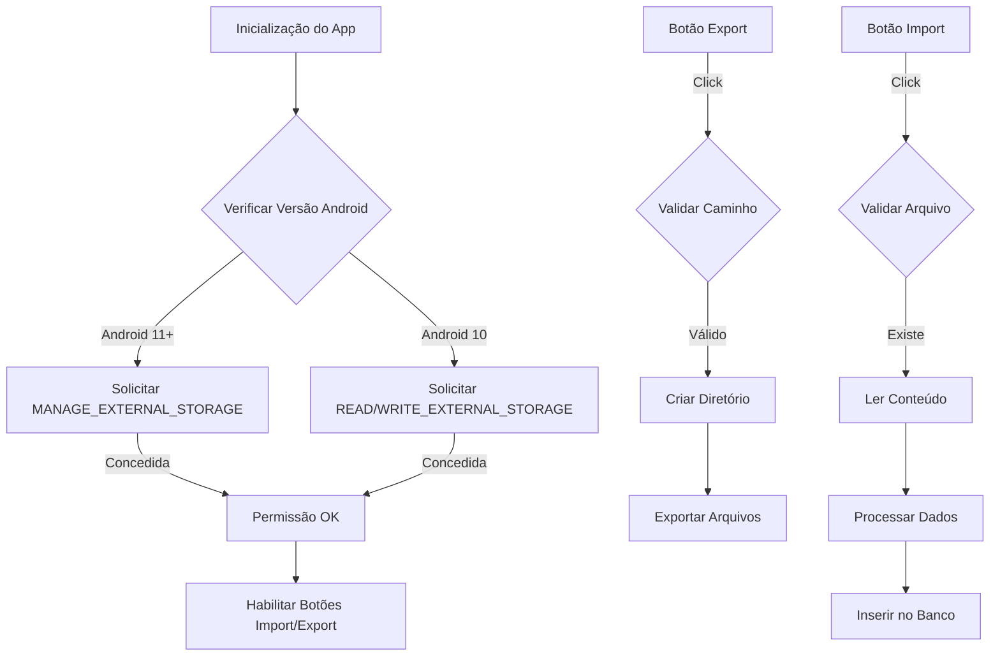

# Plano de Implementação: Migração para MANAGE_EXTERNAL_STORAGE

## Objetivo
Substituir o Storage Access Framework (SAF) pelo gerenciamento direto de arquivos usando `react-native-manage-external-storage` para exportação e importação de arquivos `.txt` no Android 10+.

## Visão Geral do Fluxo



## Resumo das Mudanças

1. **Permissões**
   - Android 11+: MANAGE_EXTERNAL_STORAGE
   - Android 10: READ/WRITE_EXTERNAL_STORAGE + requestLegacyExternalStorage
   
2. **Interface**
   - Caminho de exportação configurável com valor padrão
   - Botão para restaurar caminho padrão
   - Campo para caminho do arquivo de importação
   - Validações e normalização de caminhos
   
3. **Funcionalidades**
   - Verificação condicional de permissões por versão do Android
   - Criação automática de diretórios
   - Validação de existência de arquivos
   - Manutenção do formato atual dos arquivos

4. **Benefícios**
   - Maior controle sobre os caminhos dos arquivos
   - Melhor experiência do usuário
   - Compatibilidade com Android 10 e superior

## Formato dos Arquivos
- Mantido o formato atual: `"Inventario [product_code] [quantity]"`
- Exemplo: `"Inventario 123456 10"`
- Codificação: UTF-8
- Extensão: .txt

## 1. Fase de Preparação

### 1.1. Ambiente
```bash
# Parar Metro Bundler
npx react-native stop

# Instalar pacote
npm install react-native-manage-external-storage
```

### 1.2. AndroidManifest.xml
```xml
<!-- Para Android 11+ -->
<uses-permission android:name="android.permission.MANAGE_EXTERNAL_STORAGE" />

<!-- Para Android 10 -->
<uses-permission android:name="android.permission.READ_EXTERNAL_STORAGE"/>
<uses-permission android:name="android.permission.WRITE_EXTERNAL_STORAGE"/>

<application
    ...
    android:requestLegacyExternalStorage="true"
>
```

### 1.3. Gradle Properties
```properties
android.useAndroidX=true
```

### 1.4. Reconstrução
```bash
cd android
./gradlew clean
cd ..
npx expo run:android
```

## 2. Fase de Implementação dos Serviços

### 2.1. PermissionService.js
```javascript
import { Platform } from 'react-native';
import { PermissionsAndroid } from 'react-native';
import ManageExternalStorage from 'react-native-manage-external-storage';

export class PermissionService {
  async checkAndRequestStoragePermissions() {
    if (Platform.Version >= 30) {
      // Android 11+
      const hasPermission = await ManageExternalStorage.isGranted();
      if (!hasPermission) {
        return await ManageExternalStorage.requestExternalStoragePermission();
      }
      return true;
    } else {
      // Android 10
      const granted = await PermissionsAndroid.request(
        PermissionsAndroid.PERMISSIONS.WRITE_EXTERNAL_STORAGE
      );
      return granted === PermissionsAndroid.RESULTS.GRANTED;
    }
  }
}

export const permissionService = new PermissionService();
```

### 2.2. ExportService.js
```javascript
import * as FileSystem from 'expo-file-system';
import { Alert } from 'react-native';
import { expoDbManager } from '../database/expo-manager';

export class ExportService {
  /**
   * Realizar exportação completa de dados
   * @param {string} baseExportPath Caminho base para exportação dos arquivos
   */
  async exportData(baseExportPath) {
    console.log('EXPORT_SERVICE: Iniciando exportação de dados...');
    
    try {
      // Validar caminho base
      if (!baseExportPath?.trim()) {
        throw new Error('Caminho de exportação inválido');
      }
      
      // Criar diretório de exportação se não existir
      await FileSystem.makeDirectoryAsync(baseExportPath, { intermediates: true });
      
      // Buscar todos os motivos cadastrados
      const reasons = await expoDbManager.getReasons();
      
      if (!reasons || reasons.length === 0) {
        throw new Error('Nenhum motivo encontrado no banco de dados');
      }
      
      console.log(`EXPORT_SERVICE: ${reasons.length} motivos encontrados`);
      
      // Resultados da exportação
      const results = {
        totalReasons: reasons.length,
        successfulExports: 0,
        failedExports: 0,
        exportedFiles: [],
        errors: [],
        exportPath: baseExportPath
      };
      
      // Processar cada motivo
      for (const reason of reasons) {
        try {
          const exported = await this.exportReasonData(reason, baseExportPath);
          if (exported) {
            results.successfulExports++;
            results.exportedFiles.push(exported);
          }
        } catch (error) {
          console.error(`EXPORT_SERVICE: Erro ao exportar motivo ${reason.code}:`, error);
          results.failedExports++;
          results.errors.push({
            reason: reason.code,
            error: error.message
          });
        }
      }
      
      // Exibir resultado final
      this.showExportResults(results);
      return results;
      
    } catch (error) {
      console.error('EXPORT_SERVICE: Erro na exportação:', error);
      Alert.alert('Erro na Exportação', error.message);
      throw error;
    }
  }
  
  /**
   * Exportar dados de um motivo específico
   */
  async exportReasonData(reason, baseExportPath) {
    try {
      console.log(`EXPORT_SERVICE: Processando motivo ${reason.code}`);
      
      // Buscar entradas não sincronizadas
      const entries = await expoDbManager.getUnsynchronizedEntriesByReason(reason.id);
      
      if (!entries || entries.length === 0) {
        console.log(`EXPORT_SERVICE: Nenhuma entrada para motivo ${reason.code}`);
        return null;
      }
      
      // Gerar nome do arquivo e caminho completo
      const fileName = this.generateFileName(reason.code);
      const fullPath = `${baseExportPath}${fileName}`;
      
      // Gerar conteúdo e salvar arquivo
      const fileContent = this.generateFileContent(entries);
      await FileSystem.writeAsStringAsync(fullPath, fileContent, {
        encoding: FileSystem.EncodingType.UTF8
      });
      
      // Marcar entradas como sincronizadas
      const entryIds = entries.map(entry => entry.id);
      await expoDbManager.markEntriesAsSynchronized(entryIds);
      
      return {
        reason: reason.code,
        fileName,
        path: fullPath,
        entriesCount: entries.length
      };
      
    } catch (error) {
      console.error(`EXPORT_SERVICE: Erro ao exportar motivo ${reason.code}:`, error);
      throw error;
    }
  }

  // Manter os métodos existentes generateFileName e generateFileContent
  // Atualizar showExportResults para usar o novo formato de resultados
  showExportResults(results) {
    const { totalReasons, successfulExports, failedExports, exportedFiles, errors, exportPath } = results;
    
    if (successfulExports === 0 && failedExports === 0) {
      Alert.alert(
        'Exportação Concluída',
        'Nenhuma entrada pendente encontrada para exportação.',
        [{ text: 'OK' }]
      );
      return;
    }
    
    let message = `Exportação concluída!\n\n`;
    message += `• Motivos processados: ${totalReasons}\n`;
    message += `• Exportações bem-sucedidas: ${successfulExports}\n`;
    
    if (failedExports > 0) {
      message += `• Falhas: ${failedExports}\n`;
    }
    
    if (exportedFiles.length > 0) {
      message += `\nArquivos gerados:\n`;
      exportedFiles.forEach(file => {
        message += `• ${file.fileName} (${file.entriesCount} entradas)\n`;
      });
    }
    
    if (errors.length > 0) {
      message += `\nErros encontrados:\n`;
      errors.forEach(error => {
        message += `• Motivo ${error.reason}: ${error.error}\n`;
      });
    }
    
    message += `\nArquivos salvos em:\n${exportPath}`;
    
    Alert.alert(
      successfulExports > 0 ? 'Exportação Realizada' : 'Exportação com Problemas',
      message,
      [{ text: 'OK' }]
    );
  }
}

// Exportar instância singleton
export const exportService = new ExportService();
```

### 2.3. ImportService.js
```javascript
import * as FileSystem from 'expo-file-system';
import { expoDbManager } from '../database/expo-manager';

export class ImportService {
  async importDataFromFile(filePathToImport) {
    const content = await FileSystem.readAsStringAsync(filePathToImport, {
      encoding: FileSystem.EncodingType.UTF8
    });

    const lines = content.split('\n').filter(line => line.trim());
    const entries = [];

    for (const line of lines) {
      const match = line.match(/Inventario (\S+) (\S+)/);
      if (match) {
        entries.push({
          product_code: match[1],
          quantity: parseFloat(match[2])
        });
      }
    }

    if (entries.length > 0) {
      await expoDbManager.insertBatchEntries(entries);
      return entries.length;
    }

    throw new Error('Nenhuma entrada válida encontrada no arquivo');
  }
}

export const importService = new ImportService();
```

## 3. Fase de Interface do Usuário

### 3.1. HomeScreen.js
```javascript
// Constantes
const DEFAULT_EXPORT_PATH = '/storage/emulated/0/InventExports/';

// Novos estados
const [exportBasePath, setExportBasePath] = useState(DEFAULT_EXPORT_PATH);
const [importFilePath, setImportFilePath] = useState('');
const [storagePermissionGranted, setStoragePermissionGranted] = useState(false);

// Funções auxiliares
const validateAndNormalizePath = (path) => {
  if (!path.trim()) return '';
  
  // Garantir que termina com '/'
  let normalizedPath = path.trim();
  if (!normalizedPath.endsWith('/')) {
    normalizedPath += '/';
  }
  
  // Remover barras duplicadas
  normalizedPath = normalizedPath.replace(/\/+/g, '/');
  
  return normalizedPath;
};

// Handler para mudança no caminho de exportação
const handleExportPathChange = (text) => {
  setExportBasePath(validateAndNormalizePath(text));
};

// Campos de texto para caminhos
<View style={styles.inputContainer}>
  <Text style={styles.inputLabel}>Caminho de Exportação</Text>
  <TextInput
    value={exportBasePath}
    onChangeText={handleExportPathChange}
    placeholder={DEFAULT_EXPORT_PATH}
    style={styles.textInput}
  />
  <TouchableOpacity
    onPress={() => setExportBasePath(DEFAULT_EXPORT_PATH)}
    style={styles.resetButton}
    activeOpacity={0.7}
  >
    <Text style={styles.resetButtonText}>Restaurar Padrão</Text>
  </TouchableOpacity>
</View>

<View style={styles.inputContainer}>
  <Text style={styles.inputLabel}>Arquivo para Importação</Text>
  <TextInput
    value={importFilePath}
    onChangeText={setImportFilePath}
    placeholder="Digite o caminho completo do arquivo para importar"
    style={styles.textInput}
  />
</View>

// Handlers atualizados com validações
const handleExport = async () => {
  if (!storagePermissionGranted) {
    Alert.alert('Erro', 'Sem permissão de acesso ao armazenamento');
    return;
  }

  const path = validateAndNormalizePath(exportBasePath);
  if (!path) {
    Alert.alert('Erro', 'Por favor, insira um caminho de exportação válido');
    return;
  }

  try {
    await FileSystem.makeDirectoryAsync(path, { intermediates: true });
    await exportService.exportData(path);
  } catch (error) {
    console.error('HOMESCREEN: Erro na exportação:', error);
    Alert.alert('Erro na Exportação', error.message);
  }
};

const handleImport = async () => {
  if (!storagePermissionGranted) {
    Alert.alert('Erro', 'Sem permissão de acesso ao armazenamento');
    return;
  }

  if (!importFilePath.trim()) {
    Alert.alert('Erro', 'Por favor, insira o caminho do arquivo para importar');
    return;
  }

  try {
    const fileExists = await FileSystem.getInfoAsync(importFilePath);
    if (!fileExists.exists) {
      throw new Error('Arquivo não encontrado');
    }
    
    await importService.importDataFromFile(importFilePath);
    Alert.alert('Sucesso', 'Importação concluída com sucesso');
  } catch (error) {
    console.error('HOMESCREEN: Erro na importação:', error);
    Alert.alert('Erro na Importação', error.message);
  }
};

// Novos estilos
const styles = StyleSheet.create({
  ...existingStyles,
  resetButton: {
    marginTop: 4,
    padding: 8,
    backgroundColor: theme.colors.surface,
    borderRadius: theme.borderRadius.sm,
    borderWidth: 1,
    borderColor: theme.colors.primary,
    alignSelf: 'flex-start',
  },
  resetButtonText: {
    color: theme.colors.primary,
    fontSize: theme.typography.sizes.bodySmall,
    textAlign: 'center',
  },
});
```

### 3.2. App.js
```javascript
useEffect(() => {
  const checkPermissions = async () => {
    try {
      const granted = await permissionService.checkAndRequestStoragePermissions();
      setStoragePermissionGranted(granted);
      
      if (!granted) {
        Alert.alert(
          'Permissão Necessária',
          'O acesso ao armazenamento é necessário para importação/exportação de dados.'
        );
      }
    } catch (error) {
      console.error('Erro ao verificar permissões:', error);
      setStoragePermissionGranted(false);
    }
  };

  checkPermissions();
}, []);
```

## 4. Fase de Testes

### 4.1. Cenários de Teste Android 10
- Verificar concessão de READ_EXTERNAL_STORAGE e WRITE_EXTERNAL_STORAGE
- Validar requestLegacyExternalStorage
- Testar exportação para caminho configurado
- Testar importação de arquivo existente
- Verificar tratamento de erros de permissão

### 4.2. Cenários de Teste Android 11+
- Verificar concessão de MANAGE_EXTERNAL_STORAGE
- Testar exportação para caminho configurado
- Testar importação de arquivo existente
- Validar acesso a diferentes diretórios
- Verificar tratamento de erros de permissão

### 4.3. Testes de Caminhos
- Testar caminhos com espaços
- Testar caminhos com caracteres especiais
- Validar criação de diretórios não existentes
- Verificar tratamento de caminhos inválidos

### 4.4. Testes de Validação
- Validar formato do arquivo importado
- Verificar tratamento de arquivos corrompidos
- Testar importação de arquivos vazios
- Validar feedback de erro ao usuário