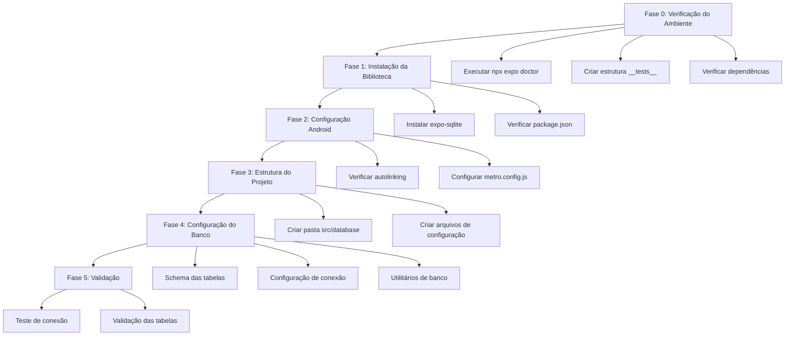

# Plano de Configuração SQLite - Projeto React Native 'invent' (ATUALIZADO)

## Análise do Projeto Atual

- ✅ React Native 0.79.2 com Expo ~53.0.9 (Bare Workflow)
- ✅ Permissões READ_EXTERNAL_STORAGE e WRITE_EXTERNAL_STORAGE já configuradas no AndroidManifest.xml
- ✅ New Architecture habilitada (newArchEnabled=true)
- ✅ Hermes JS Engine habilitado
- ✅ Projeto configurado para Android SDK 34-36 (compatível)
- ❌ Pasta `.bundle` não encontrada
- ❌ Pasta `__tests__` não encontrada - **NECESSÁRIA CONFIGURAÇÃO**

## IMPORTANTE: Mudança de Biblioteca

**ATUALIZAÇÃO:** Usar `expo-sqlite` ao invés de `react-native-sqlite-storage`

**Razões para a mudança:**
- Melhor integração com Expo Bare Workflow
- Suporte nativo à New Architecture
- Menos configuração manual necessária
- Melhor compatibilidade com autolinking do Expo
- Manutenção ativa pela equipe Expo

## Fases do Plano (ATUALIZADO)



## Fase 0: Verificação do Ambiente (NOVA)

### 0.1 Diagnóstico com Expo Doctor
```bash
npx expo doctor
```

### 0.2 Criação da Estrutura de Testes
- Criar pasta `__tests__/`
- Configurar Jest para React Native
- Adicionar testes básicos

### 0.3 Verificação de Dependências
- Java 17.0.15
- Android SDK 34-36
- React Native CLI atualizada

## Fase 1: Instalação da Biblioteca SQLite (ATUALIZADA)

### 1.1 Instalação via Expo
```bash
npx expo install expo-sqlite
```

### 1.2 Verificação no package.json
- Confirmar que expo-sqlite foi adicionada às dependências
- Versão esperada: compatível com Expo 53.x

## Fase 2: Configuração para Android (SIMPLIFICADA)

### 2.1 Autolinking Automático
- expo-sqlite tem autolinking nativo do Expo
- Não requer configuração manual do gradle

### 2.2 Verificações de Compatibilidade
- ✅ Permissões já configuradas no AndroidManifest.xml
- ✅ New Architecture totalmente compatível
- ✅ Android SDK 34-36 suportado

## Fase 3: Estrutura do Projeto

### 3.1 Criação da Estrutura de Pastas
```
src/
└── database/
    ├── index.js          # Ponto de entrada principal
    ├── connection.js     # Configuração da conexão
    ├── schema.js         # Definição das tabelas
    ├── migrations.js     # Migrações e versionamento
    └── utils.js          # Utilitários e helpers
```

## Fase 4: Configuração do Banco de Dados (ATUALIZADA)

### 4.1 Arquivo de Conexão (src/database/connection.js)
```javascript
import * as SQLite from 'expo-sqlite';

const DATABASE_NAME = 'invent.db';

// Abrir banco de dados
export const openDatabase = async () => {
  try {
    const db = await SQLite.openDatabaseAsync(DATABASE_NAME);
    console.log('Database opened successfully');
    return db;
  } catch (error) {
    console.error('Error opening database:', error);
    throw error;
  }
};

// Configuração para desenvolvimento
export const enableDebug = () => {
  if (__DEV__) {
    console.log('SQLite Debug mode enabled');
  }
};
```

### 4.2 Schema das Tabelas (src/database/schema.js)
```javascript
export const TABLES = {
  PRODUCTS: `
    CREATE TABLE IF NOT EXISTS products (
      id INTEGER PRIMARY KEY AUTOINCREMENT,
      product_code TEXT NOT NULL UNIQUE,
      product_name TEXT NOT NULL,
      regular_price REAL NOT NULL,
      club_price REAL NOT NULL,
      unit_type TEXT CHECK (unit_type IN ('KG', 'UN')) NOT NULL,
      created_at TEXT NOT NULL,
      updated_at TEXT NOT NULL,
      deleted_at TEXT,
      restored_at TEXT
    )`,
  
  REASONS: `
    CREATE TABLE IF NOT EXISTS reasons (
      id TEXT PRIMARY KEY,
      code TEXT NOT NULL,
      description TEXT NOT NULL,
      created_at TEXT NOT NULL,
      updated_at TEXT NOT NULL
    )`,
  
  ENTRIES: `
    CREATE TABLE IF NOT EXISTS entries (
      id INTEGER PRIMARY KEY AUTOINCREMENT,
      product_code TEXT NOT NULL,
      product_name TEXT NOT NULL,
      quantity REAL NOT NULL,
      reason_id TEXT NOT NULL,
      entry_date TEXT NOT NULL,
      is_synchronized BOOLEAN DEFAULT 0,
      FOREIGN KEY (product_code) REFERENCES products (product_code),
      FOREIGN KEY (reason_id) REFERENCES reasons (id)
    )`,
  
  ENTRY_CHANGES: `
    CREATE TABLE IF NOT EXISTS entry_changes (
      id INTEGER PRIMARY KEY AUTOINCREMENT,
      product_code TEXT NOT NULL,
      product_name TEXT NOT NULL,
      old_quantity REAL,
      new_quantity REAL NOT NULL,
      old_reason_id TEXT,
      new_reason_id TEXT NOT NULL,
      change_date TEXT NOT NULL,
      action_type TEXT NOT NULL CHECK (action_type IN ('insertion', 'edition', 'removal', 'movement')),
      FOREIGN KEY (old_reason_id) REFERENCES reasons (id),
      FOREIGN KEY (new_reason_id) REFERENCES reasons (id)
    )`,
  
  IMPORTS: `
    CREATE TABLE IF NOT EXISTS imports (
      id INTEGER PRIMARY KEY AUTOINCREMENT,
      file_name TEXT NOT NULL,
      import_date TEXT NOT NULL,
      items_updated INTEGER,
      items_inserted INTEGER,
      source TEXT
    )`
};

// Índices para melhor performance
export const INDEXES = {
  PRODUCTS_CODE: 'CREATE INDEX IF NOT EXISTS idx_products_code ON products (product_code)',
  ENTRIES_PRODUCT: 'CREATE INDEX IF NOT EXISTS idx_entries_product ON entries (product_code)',
  ENTRIES_DATE: 'CREATE INDEX IF NOT EXISTS idx_entries_date ON entries (entry_date)',
  ENTRY_CHANGES_PRODUCT: 'CREATE INDEX IF NOT EXISTS idx_entry_changes_product ON entry_changes (product_code)',
  ENTRY_CHANGES_DATE: 'CREATE INDEX IF NOT EXISTS idx_entry_changes_date ON entry_changes (change_date)'
};
```

### 4.3 Inicialização do Banco (src/database/index.js)
```javascript
import { openDatabase, enableDebug } from './connection';
import { TABLES, INDEXES } from './schema';

export class DatabaseManager {
  static instance = null;
  db = null;

  static getInstance() {
    if (!DatabaseManager.instance) {
      DatabaseManager.instance = new DatabaseManager();
    }
    return DatabaseManager.instance;
  }

  async initialize() {
    try {
      enableDebug();
      this.db = await openDatabase();
      await this.createTables();
      await this.createIndexes();
      console.log('Database initialized successfully');
      return this.db;
    } catch (error) {
      console.error('Database initialization failed:', error);
      throw error;
    }
  }

  async createTables() {
    const tables = Object.values(TABLES);
    
    for (const tableSQL of tables) {
      await this.db.execAsync(tableSQL);
    }
    console.log('All tables created successfully');
  }

  async createIndexes() {
    const indexes = Object.values(INDEXES);
    
    for (const indexSQL of indexes) {
      await this.db.execAsync(indexSQL);
    }
    console.log('All indexes created successfully');
  }

  async getDatabase() {
    if (!this.db) {
      await this.initialize();
    }
    return this.db;
  }
}

// Export singleton instance
export const dbManager = DatabaseManager.getInstance();
```

### 4.4 Utilitários (src/database/utils.js)
```javascript
export const getCurrentTimestamp = () => {
  return new Date().toISOString();
};

export const formatDateForDB = (date) => {
  return date instanceof Date ? date.toISOString() : date;
};

export const parseDBDate = (dateString) => {
  return dateString ? new Date(dateString) : null;
};

export const validateProductCode = (code) => {
  return typeof code === 'string' && code.length === 13 && /^\d+$/.test(code);
};

export const validateUnitType = (unitType) => {
  return ['KG', 'UN'].includes(unitType);
};

export const validateActionType = (actionType) => {
  return ['insertion', 'edition', 'removal', 'movement'].includes(actionType);
};
```

## Fase 5: Validação e Testes

### 5.1 Teste de Conexão
```javascript
// __tests__/database.test.js
import { DatabaseManager } from '../src/database';

describe('Database Connection', () => {
  let dbManager;

  beforeAll(async () => {
    dbManager = DatabaseManager.getInstance();
    await dbManager.initialize();
  });

  it('should connect to database', async () => {
    const db = await dbManager.getDatabase();
    expect(db).toBeDefined();
  });

  it('should create all tables', async () => {
    const db = await dbManager.getDatabase();
    // Verificar se tabelas existem
    const result = await db.getAllAsync(
      "SELECT name FROM sqlite_master WHERE type='table'"
    );
    
    const tableNames = result.map(row => row.name);
    expect(tableNames).toContain('products');
    expect(tableNames).toContain('reasons');
    expect(tableNames).toContain('entries');
    expect(tableNames).toContain('entry_changes');
    expect(tableNames).toContain('imports');
  });
});
```

### 5.2 Integração com App.js
```javascript
// App.js - exemplo de inicialização
import React, { useEffect, useState } from 'react';
import { dbManager } from './src/database';

export default function App() {
  const [dbReady, setDbReady] = useState(false);

  useEffect(() => {
    const initDatabase = async () => {
      try {
        await dbManager.initialize();
        setDbReady(true);
      } catch (error) {
        console.error('Failed to initialize database:', error);
      }
    };

    initDatabase();
  }, []);

  if (!dbReady) {
    return <LoadingScreen />;
  }

  return <MainApp />;
}
```

## Vantagens da Nova Configuração

1. **Simplicidade:** expo-sqlite requer menos configuração
2. **Compatibilidade:** Melhor suporte à New Architecture
3. **Manutenção:** Biblioteca oficial do Expo
4. **Performance:** Otimizada para React Native moderno
5. **Debugging:** Melhor integração com ferramentas de desenvolvimento

## Considerações Importantes

1. **Versionamento do Banco:** Sistema de migrações implementado
2. **Performance:** Índices adicionados para consultas frequentes
3. **Backup/Sincronização:** Estrutura preparada para sincronização
4. **Segurança:** Validações de dados implementadas
5. **Testes:** Estrutura de testes configurada

## Próximos Passos Após Implementação

1. Implementar DAOs (Data Access Objects) para cada tabela
2. Criar serviços de sincronização
3. Implementar sistema de backup local
4. Adicionar validações de negócio
5. Criar hooks React para operações de banco

---

**Status:** Plano atualizado com expo-sqlite e verificação de ambiente
**Data:** 25/05/2025
**Versão:** 2.0

**ATENÇÃO:** Execute primeiro a verificação do ambiente conforme `docs/environment-setup.md` antes de prosseguir com esta implementação.